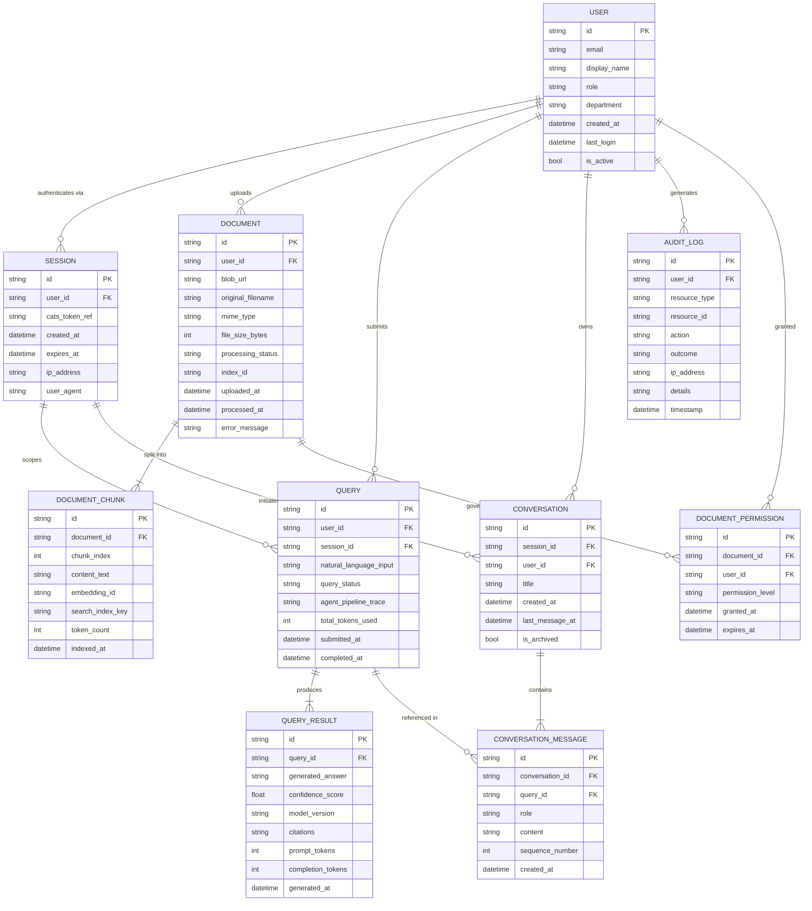
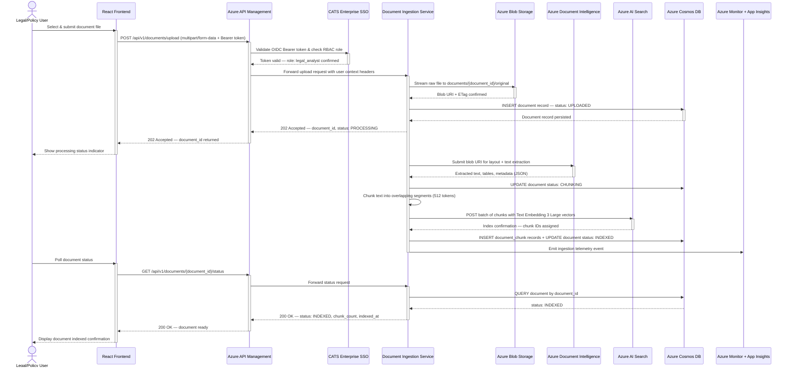
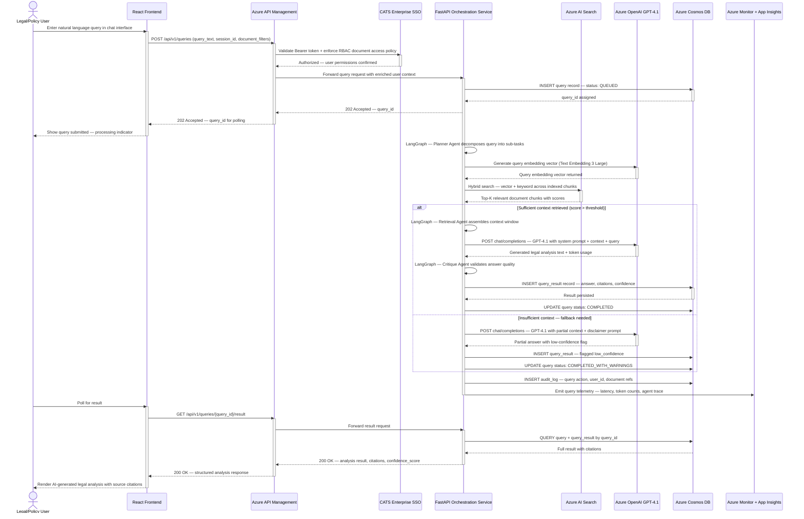

# HELIX Architecture

<!-- @helix generated -->

# Solution Architecture Document

## Selected Architecture: SLLIP Azure-Native Serverless Architecture

> A fully managed, Azure-native serverless platform leveraging Container Apps and multi-agent AI orchestration for rapid deployment at enterprise scale.

---

## Executive Summary

This architecture leverages Azure Container Apps as the primary compute layer, eliminating Kubernetes operational overhead while retaining container flexibility — ideal for a 15–50 user scale. The multi-agent LLM pipeline is orchestrated via LangGraph on FastAPI microservices, with Azure Document Intelligence and Azure AI Search handling document ingestion and semantic retrieval. Enterprise authentication is handled by CATS SSO/RBAC, with all state, audit trails, and vector metadata persisted in Azure Cosmos DB, ensuring compliance and traceability across all AI interactions.

### Why This Option Was Selected
A fully managed, Azure-native serverless platform leveraging Container Apps and multi-agent AI orchestration for rapid deployment at enterprise scale.

---

## Architecture Overview

**Complexity:** Medium
**Estimated Monthly Cost:** $2,500-$4,500
**MVP Timeline:** 10 weeks
**Scalability:** Auto-scaling
**Compliance Fit:** Full

### Tech Stack
- React.js
- FastAPI (Python)
- Azure Container Apps
- Azure OpenAI (GPT-4.1)
- LangChain + LangGraph
- Azure Document Intelligence
- Azure AI Search + Text Embedding 3 Large
- Azure Cosmos DB
- Azure Blob Storage
- Azure API Management
- CATS SSO/RBAC

---

## Detailed Description

This architecture leverages Azure Container Apps as the primary compute layer, eliminating Kubernetes operational overhead while retaining container flexibility — ideal for a 15–50 user scale. The multi-agent LLM pipeline is orchestrated via LangGraph on FastAPI microservices, with Azure Document Intelligence and Azure AI Search handling document ingestion and semantic retrieval. Enterprise authentication is handled by CATS SSO/RBAC, with all state, audit trails, and vector metadata persisted in Azure Cosmos DB, ensuring compliance and traceability across all AI interactions.

---

## System Architecture Diagram

_(System Architecture Diagram — rendering unavailable)_

---

## Components

### Users
**Technology:** End Users (Legal/Policy Teams)

15–50 enterprise users accessing SLLIP via web browser, authenticated through CATS SSO

### Azure CDN + WAF
**Technology:** Azure Front Door + WAF

Global CDN layer serving the React frontend with integrated Web Application Firewall for DDoS and OWASP threat protection

### React Frontend
**Technology:** React.js

Single-page application providing the SLLIP user interface — document upload, AI query interface, results review, and audit history views

### CATS SSO
**Technology:** CATS Enterprise SSO (OIDC/OAuth2)

Enterprise identity provider handling authentication and RBAC role claims. Issues JWT tokens consumed by API Management for request authorization

### Azure API Management
**Technology:** Azure API Management (APIM)

Unified API gateway enforcing JWT validation against CATS SSO, rate limiting, request routing, API versioning, and centralised logging for all backend services

### FastAPI Orchestration Service
**Technology:** FastAPI (Python) on Azure Container Apps

Core backend service hosting LangChain + LangGraph multi-agent orchestration logic. Manages agent workflows, routes queries to Azure OpenAI, coordinates retrieval from Azure AI Search, and persists state to Cosmos DB

### Document Ingestion Service
**Technology:** FastAPI (Python) on Azure Container Apps

Dedicated microservice handling document upload pipeline: receives files, stores raw documents in Blob Storage, triggers Azure Document Intelligence for extraction, generates embeddings via Text Embedding 3 Large, and indexes into Azure AI Search

### Azure OpenAI (GPT-4.1)
**Technology:** Azure OpenAI Service — GPT-4.1

Primary LLM for natural language understanding, document analysis, summarisation, and AI response generation. Deployed in Azure-managed environment with no training data usage guarantee

### Azure Document Intelligence
**Technology:** Azure Document Intelligence (Form Recognizer)

Managed Azure service for extracting structured text, tables, and key-value pairs from uploaded PDF and Office documents prior to embedding and indexing

### Azure AI Search
**Technology:** Azure AI Search + Text Embedding 3 Large

Hybrid vector and keyword search index storing document chunk embeddings generated by Text Embedding 3 Large. Supports semantic ranking for high-accuracy retrieval-augmented generation (RAG) pipelines

### Azure Cosmos DB
**Technology:** Azure Cosmos DB (NoSQL API)

Primary operational database storing agent state, conversation history, user session data, and a full audit trail of all AI interactions and document processing events for compliance and governance

### Azure Blob Storage
**Technology:** Azure Blob Storage

Durable object storage for raw uploaded documents, processed document artifacts, and export outputs. Tiered storage lifecycle policies move infrequently accessed documents to cool/archive tiers

### Azure Monitor + App Insights
**Technology:** Azure Monitor + Application Insights

Centralised observability platform providing distributed tracing, performance metrics, error alerting, and LLM token usage dashboards across all Container Apps services


---

## Database Design

**Type:** NoSQL (Document)
**Technology:** Azure Cosmos DB (NoSQL API)

### Schema Overview
Five primary containers: (1) agent_sessions — stores LangGraph workflow state, conversation history, and session metadata keyed by session_id; (2) audit_trail — append-only records of all AI interactions, document processing events, and user actions with timestamp, user_id, action_type, and payload fields; TTL policy aligned to enterprise retention requirements; (3) documents_metadata — tracks uploaded document records including status, ingestion timestamps, extraction confidence scores, and Blob Storage URIs; (4) query_results — persists AI-generated analysis outputs linked to session and document references for result retrieval and caching; (5) user_preferences — stores per-user UI and workflow configuration preferences. Partition keys optimised for query patterns: session_id for agent_sessions, user_id for audit_trail, document_id for documents_metadata.



---

## API Design

**Style:** REST

### Key Endpoints
- `POST /api/v1/documents/upload — Upload document for ingestion and indexing`
- `GET /api/v1/documents/{document_id}/status — Poll document processing status`
- `POST /api/v1/queries — Submit a natural language query to the multi-agent pipeline`
- `GET /api/v1/queries/{query_id}/result — Retrieve AI-generated analysis result`
- `GET /api/v1/audit/trail — Retrieve paginated audit log entries (RBAC-gated)`
- `GET /api/v1/conversations/{session_id} — Retrieve conversation history for a session`
- `DELETE /api/v1/documents/{document_id} — Remove document and associated index entries`
- `GET /api/v1/health — Health check endpoint for Container Apps liveness probe`

---

## Deployment Architecture

_(Deployment Architecture Diagram — rendering unavailable)_

---

## Data Flow Diagram

_(Data Flow Diagram — rendering unavailable)_

---

## Workflow Sequence Diagrams

### 1. Document Upload, Ingestion & AI Indexing Pipeline



### 2. Multi-Agent Natural Language Query & AI Analysis Workflow



### 3. Audit Trail Retrieval with RBAC Enforcement & Conversation History

```mermaid
sequenceDiagram
    actor AdminUser as Admin / Compliance Officer
    participant Frontend as React Frontend
    participant CDN as Azure Front Door + WAF
    participant APIM as Azure API Management
    participant CATS as CATS Enterprise SSO
    participant OrchSvc as FastAPI Orchestration Service
    participant CosmosDB as Azure Cosmos DB
    participant Monitor as Azure Monitor + App Insights

    AdminUser->>CDN: Navigate to Audit & Compliance dashboard
    activate CDN
    CDN->>CDN: WAF policy inspection — validate request headers, rate limit
    CDN-->>AdminUser: Serve React Frontend via CDN edge node
    deactivate CDN

    AdminUser->>Frontend: Initiate audit log retrieval with date range + user filters
    activate Frontend
    Frontend->>APIM: GET /api/v1/audit/trail?from=2025-01-01&to=2025-06-01&page=1&limit=50
    activate APIM
    APIM->>CATS: Validate Bearer token — check role claim contains compliance_admin
    activate CATS

    alt User has compliance_admin or system_admin role
        CATS-->>APIM: Authorized — full audit scope granted
        deactivate CATS
        APIM->>OrchSvc: Forward audit request with validated user context
        activate OrchSvc
        OrchSvc->>CosmosDB: QUERY audit_log — filter by date range, paginate, ORDER BY timestamp DESC
        activate CosmosDB
        CosmosDB-->>OrchSvc: Paginated audit entries (50 records + total_count)
        deactivate CosmosDB
        OrchSvc->>CosmosDB: INSERT audit_log — record this audit retrieval action
        OrchSvc->>Monitor: Emit audit access event to App Insights
        OrchSvc-->>APIM: 200 OK — audit entries array + pagination metadata
        deactivate OrchSvc
        APIM-->>Frontend: 200 OK — full audit trail data
        Frontend-->>AdminUser: Render paginated audit table with user, action, timestamp columns
    else User lacks required compliance role
        CATS-->>APIM: 403 Forbidden — insufficient RBAC role
        deactivate CATS
        APIM->>OrchSvc: Log unauthorized access attempt
        activate OrchSvc
        OrchSvc->>CosmosDB: INSERT audit_log — UNAUTHORIZED action, user_id, endpoint
        OrchSvc->>Monitor: Emit security alert — unauthorized audit access attempt
        deactivate OrchSvc
        APIM-->>Frontend: 403 Forbidden — access denied message
        Frontend-->>AdminUser: Display permission denied error with contact info
    end
    deactivate APIM

    opt Admin drills into a specific session conversation
        AdminUser->>Frontend: Click session_id link in audit row
        activate Frontend
        Frontend->>APIM: GET /api/v1/conversations/{session_id}
        activate APIM
        APIM->>CATS: Re-validate token + confirm session ownership or admin scope
        activate CATS
        CATS-->>APIM: Authorized
        deactivate CATS
        APIM->>OrchSvc: Forward conversation history request
        activate OrchSvc
        OrchSvc->>CosmosDB: QUERY conversation + conversation_message by session_id ORDER BY sequence_number
        activate CosmosDB
        CosmosDB-->>OrchSvc: Full conversation thread with query references
        deactivate CosmosDB
        OrchSvc->>CosmosDB: JOIN query_result records for each assistant message
        activate CosmosDB
        CosmosDB-->>OrchSvc: Enriched messages with AI analysis results
        deactivate CosmosDB
        OrchSvc-->>APIM: 200 OK — full conversation history with results
        deactivate OrchSvc
        APIM-->>Frontend: 200 OK — conversation thread data
        deactivate APIM
        Frontend-->>AdminUser: Render full conversation replay with queries and AI responses
        deactivate Frontend
    end

    deactivate Frontend
```

---

## Security Considerations

- All traffic encrypted in transit via TLS 1.2+ enforced at Azure Front Door and APIM layers
- JWT tokens issued by CATS SSO validated at APIM boundary — no unauthenticated requests reach backend services
- RBAC roles enforced at both APIM (coarse-grained) and FastAPI service layer (fine-grained) using CATS role claims
- Azure Blob Storage and Cosmos DB access via Managed Identity only — no shared secrets or connection strings in application code
- Azure Key Vault stores all secrets, API keys, and configuration values — accessed at runtime via Managed Identity
- Azure Document Intelligence and Azure AI Search accessed via Private Endpoints within the Azure Virtual Network
- WAF policies at Azure Front Door enforce OWASP Top 10 ruleset and custom rate-limiting rules
- Data at rest encrypted using Azure-managed keys (customer-managed keys available as upgrade path for higher compliance tiers)
- All Cosmos DB audit trail documents are immutable append-only with TTL policies aligned to enterprise data retention policy
- Container Apps environment deployed in a dedicated virtual network with network security group (NSG) policies restricting inter-service traffic

---

## Technology Decisions Register

| Technology | Rationale | Alternatives Considered | Why Rejected |
|------------|-----------|------------------------|-------------|
| Azure Container Apps | Provides managed serverless container hosting with auto-scaling to zero, eliminating Kubernetes operational overhead for a 15–50 user workload. Supports Dapr for microservice communication and integrates natively with Azure Monitor and Managed Identity. | Azure Kubernetes Service (AKS), Azure App Service | AKS adds significant operational complexity (cluster management, node pool sizing, upgrade cycles) that is not justified at this user scale. Azure App Service lacks native container orchestration features needed for multi-service LangGraph agent workflows. |
| LangGraph | Provides stateful, graph-based multi-agent orchestration natively compatible with LangChain. Enables complex document analysis workflows with conditional branching, agent checkpointing, and human-in-the-loop pause points — critical for enterprise AI governance. | AutoGen (Microsoft), Semantic Kernel | AutoGen is optimised for conversational multi-agent patterns rather than document pipeline DAGs. Semantic Kernel is .NET-first and would conflict with the established Python/FastAPI stack. |
| Azure Cosmos DB | Selected for its schema-flexible NoSQL model (ideal for variable agent state shapes), multi-region write capability, built-in TTL for audit retention policies, and native Azure Managed Identity support — aligning with enterprise compliance requirements. | Azure PostgreSQL Flexible Server, Azure SQL | Azure PostgreSQL and Azure SQL are relational databases requiring rigid schema definitions that are poorly suited to evolving LangGraph agent state structures. Both add schema migration overhead during iterative development. |
| Azure API Management (APIM) | Enterprise-grade API gateway providing JWT validation, rate limiting, usage analytics, and developer portal. Enables CATS SSO OIDC token validation at the gateway boundary without coupling auth logic into individual microservices. | Azure Application Gateway, NGINX on Container Apps | Azure Application Gateway is an L7 load balancer without native API management features (rate limiting, subscription keys, transformation policies). NGINX lacks managed OIDC integration and would require custom auth middleware development. |
| React.js | Established frontend framework with a large ecosystem, strong TypeScript support, and team familiarity. Appropriate for the SLLIP document query interface with component reuse across document upload, results display, and audit history views. | Next.js, Vue.js | Next.js SSR complexity is unnecessary for an authenticated enterprise SPA with no SEO requirements. Vue.js was not identified as a team preference and offers no material advantage over React for this use case. |

---

## Risk Assessment

| Risk | Severity | Mitigation |
|------|----------|------------|
| Azure OpenAI regional capacity constraints causing latency spikes or throttling under concurrent query load | Medium | Deploy Azure OpenAI with Provisioned Throughput Units (PTU) for predictable capacity; implement retry logic with exponential backoff in LangChain layer |
| CATS SSO OIDC integration complexity causing authentication delays during initial deployment | Medium | Allocate dedicated sprint for CATS integration spike; engage enterprise identity team early; document OIDC well-known endpoint and claim mappings before architecture build begins |
| Cosmos DB RU consumption spikes during bulk document ingestion events exceeding provisioned throughput | Medium | Enable Cosmos DB autoscale RU mode; implement ingestion queue with back-pressure control in Document Ingestion Service; monitor RU consumption via Azure Monitor alerts |
| LangGraph multi-agent workflow failures producing incomplete or hallucinated outputs without user awareness | High | Implement LangGraph checkpointing for workflow state recovery; add confidence scoring and source citation to all AI responses; include human-in-the-loop review step for high-stakes outputs |
| Azure Document Intelligence accuracy degradation on non-standard document formats or poor quality scans | Low | Implement document quality pre-check; surface extraction confidence scores in audit trail; allow users to flag low-confidence extractions for manual review |
| Vendor lock-in to Azure-native services limiting future portability | Low | Abstract LLM and search interactions behind internal service interfaces; LangChain provider abstraction layer enables alternative LLM backends if required |

---

## Strengths

- Fully Azure-native stack ensures no data used for model training, meeting enterprise compliance requirements out-of-the-box
- Azure Container Apps provides auto-scaling to zero, minimising costs for a 15–50 user workload with variable usage patterns
- LangGraph multi-agent orchestration enables complex document reasoning workflows with built-in state management
- Azure AI Search with Text Embedding 3 Large delivers high-accuracy semantic retrieval over ingested legal/policy documents
- CATS SSO integration leverages existing enterprise identity infrastructure with zero additional IAM overhead
- Azure Cosmos DB provides globally consistent audit trail storage with TTL policies for compliance data retention
- Azure API Management acts as a unified gateway enforcing rate limiting, auth validation, and API versioning

---

## Trade-offs & Considerations

- Azure Container Apps has less ecosystem maturity than AKS for advanced multi-agent workload scheduling — mitigated by LangGraph's built-in DAG orchestration
- Cosmos DB RU-based pricing can spike unpredictably under heavy write loads during bulk document ingestion events
- LangGraph is a relatively newer framework; long-term community support and upgrade paths require monitoring
- Azure Document Intelligence page-based pricing model means large document batches will increase per-ingestion costs non-linearly
- CATS integration specifics are enterprise-internal and may require bespoke OIDC configuration work not covered by standard Azure AD documentation

---

## Cost Breakdown

| Item | Monthly Cost | Notes |
|------|-------------|-------|
| Azure Container Apps (Orchestration + Ingestion Services) | $150-$300 | Scale-to-zero for off-hours; consumption-based billing. Estimated 2–4 vCPU active hours per day at 15–50 user load. |
| Azure OpenAI (GPT-4.1) | $800-$1,800 | Pay-as-you-go token pricing; estimate based on ~500 queries/day at avg 2,000 input + 1,000 output tokens. PTU reservation recommended if usage stabilises. |
| Azure AI Search | $250-$400 | Standard S1 tier supporting up to 50GB index, semantic ranking enabled. Includes vector search quota for Text Embedding 3 Large embeddings. |
| Azure Cosmos DB | $200-$400 | Autoscale RU mode; estimated 400–4,000 RU/s range. Includes audit trail and agent state containers with 90-day TTL retention. |
| Azure Document Intelligence | $150-$300 | Read API at $1.50/1,000 pages; estimated 100–200 documents/month at avg 10 pages each. |
| Azure Blob Storage | $50-$100 | Hot tier for active documents; lifecycle policy moves documents >90 days to cool tier. Estimated 500GB total storage growth over 12 months. |
| Azure API Management | $150-$250 | Developer tier for MVP; upgrade to Standard tier post-MVP for SLA and higher call volumes. ~50,000 API calls/month estimated. |
| Azure Front Door + WAF | $100-$150 | Standard tier with WAF policy. Includes CDN for React frontend static assets. |
| Azure Monitor + Application Insights | $50-$100 | Log Analytics workspace with 5GB/day ingestion estimate; 90-day retention. Distributed tracing across Container Apps services. |
| Azure Key Vault + Networking (VNet, NSG, Private Endpoints) | $50-$100 | Private endpoints for Cosmos DB, AI Search, and Blob Storage. NSG rules and VNet integration for Container Apps environment. |

---

## Alternative Options Considered

### Option Comparison Summary

| Aspect | SLLIP Azure-Native Serverless Architecture | Other Options |
|--------|---------|---------------|
| Complexity | Medium | Varies |
| Cost | $2,500-$4,500 | Varies |
| Timeline | 10 weeks | Varies |

---

*Document generated by user*
*Selection Date: 2026-08-19T08:04:44.477969+00:00*
